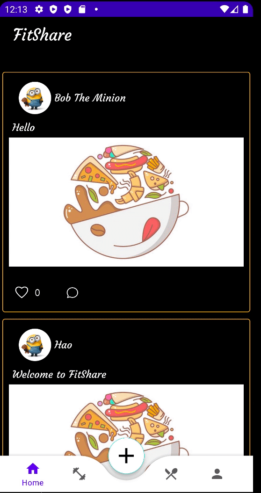

# FitShare
FitShare is a social Fitness-Nutrition mobile application written in Kotlin and connected with a MongoDB Realm backend. This is my senior group project, where I worked with four other teammates. The devloping process actually took around 8 months, where the first 2 months is for brainstorming, planning, and setting up our backend. There were a lot of arguments, conflicts, and difficulties; but foruntately, we make it!!! We had the opportunity to represent our class in the Senior Expo 2022, and was honored as oen of the "Most socially impactful application".

Feel free to fork or download this project so you could try it out and use this code as a foundation to create your own social app :grin:.

**Goal**: Build a community around fitness and recipe cooking.

## Features
### Nutrition
  * View all recipes or your uploaded recipes
  * Add/Modify recipes and view recipe steps and ingredients
  * Search for recipes
### Fitness
  * Design a fitness diary to log caloric intake and workout exercises
  * Provides a variety of workout plans for users to follow or custom
### Social
  * Share recipes, workout advices, or daily activities
  * Communicate and Connect with other users
  * Invite nearby users for a cooking meeting

## DEMO TIME
### Bottom Navigation Bar

  

                                                        
* We have four pages: Feeds Tab, Fitnes, Recipe, and Profile. 
* The floating button is one of our unique features. It is a dynamic add button, which performs differnt actions in each pages
  * Feeds: Uploading posts
  * Fitness: Pop up three buttons: Select Workout Plans, Add Exercises, and Add Foods
  * Recipe: Uploading recipes
  * Profile: Uploading/Modifying profile, and LogOut
 
### Feed Tab

  

### Recipe

  

### Profile

  

### Fitness

  

## Thank you

I hope you enjoy the project.

-- [Hao On](https://www.linkedin.com/in/hao-on/)

